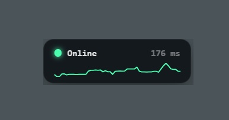

# LiveNAT

Minimal always-on-top internet connectivity indicator for ICE trains (or anywhere with flaky Wi-Fi).



A tiny 200×60 px pill overlay that tells you at a glance whether you're online:

- **🟢 Online** — connection is good, shows latency in ms
- **🟡 Instabil** — packet loss or high latency (>300 ms)
- **🔴 Offline** — pulsing red dot, no connectivity
- **Sparkline** — 3-minute RTT trend so you can see tunnels and dead zones

Drag anywhere. Right-click → **Über LiveNAT** for credits, **Beenden** to quit.

## Download

**[⬇ Download Latest](https://github.com/jenssgb/LiveNAT/releases/latest)** — Windows installer, creates Desktop & Start Menu shortcut.

> The exe is not code-signed. Windows SmartScreen may warn — click *More info* → *Run anyway*.

## Quick start (dev)

```bash
npm install
npm start
```

## How it works

Every **3 seconds**, LiveNAT pings Google (`generate_204`) and Cloudflare (`cdn-cgi/trace`) via HTTPS in parallel. The worst-case median RTT and packet loss across both probes determines your status:

| Status | Condition |
|---|---|
| 🟢 **Online** | Packet loss < 10% and latency < 300 ms |
| 🟡 **Instabil** | Loss ≥ 10% or latency > 300 ms |
| 🔴 **Offline** | Loss > 50% or no successful response |

- Evaluation window: last ~15 seconds (up to 10 samples per target)
- Timeout per probe: 4 seconds
- Sparkline: 3-minute RTT trend
- No ICMP, no telemetry — everything stays in-memory

## Configuration

Targets, thresholds, and intervals are defined at the top of `main.js`.

## Credits

- **Jens Schneider** — Idea, design & development
- **GitHub Copilot (Claude)** — Pair programming & implementation

## License

[MIT](LICENSE)
